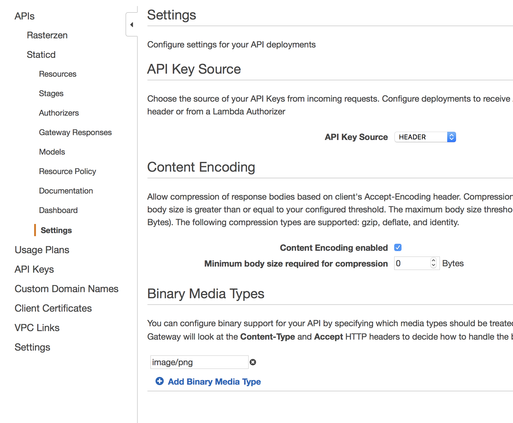
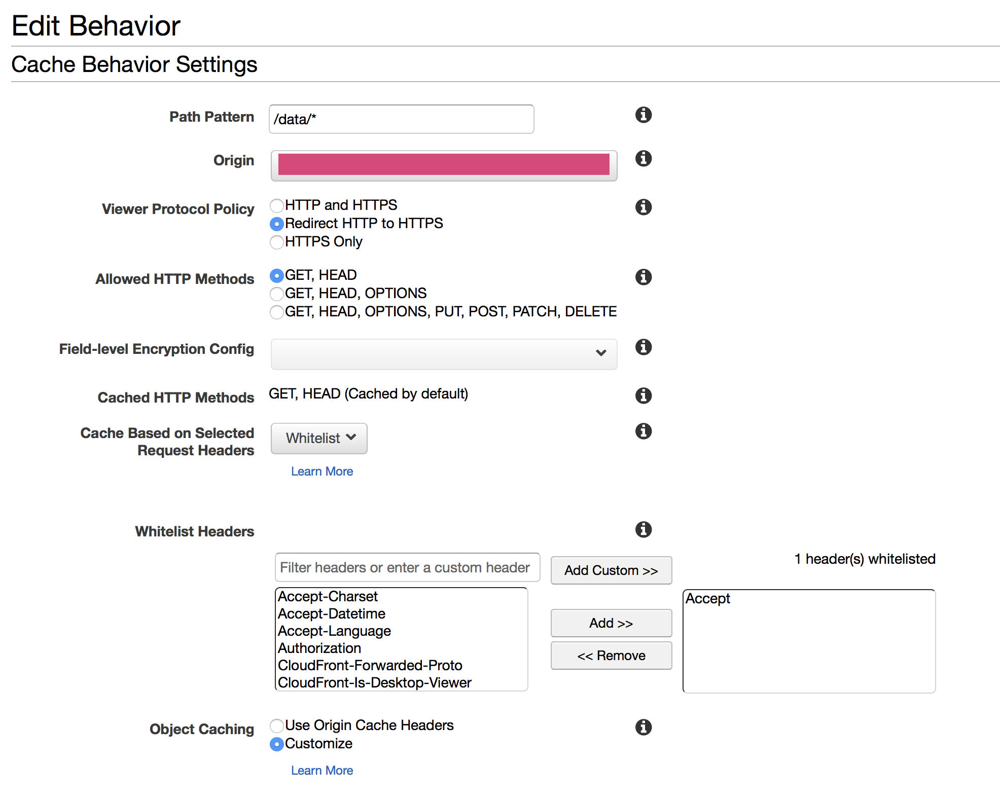

# go-whosonfirst-static-lambda

Run the `go-whosonfirst-static` code in an AWS Lambda function.

## Install

You will need to have both `Go` (specifically a version of Go more recent than 1.7 so let's just assume you need [Go 1.9](https://golang.org/dl/) or higher) and the `make` programs installed on your computer. Assuming you do just type:

```
make bin
```

All of this package's dependencies are bundled with the code in the `vendor` directory.

## Important

_This code will be merged back in to `go-whosonfirst-static` once we finish working out all the weird AWS/Lambda -isms..._

This is _super_ early work and does not yet support all the features of the `go-whosonfirst-static` package. Here is a short list of things this package lacks:

* Documentation, specifically about how to set things up as a Lambda
  function. Have a look at the
  [go-rasterzen-lambda](https://github.com/whosonfirst/go-rasterzen-lambda)
  package. It's basically the same thing.

* Support for reading data from anything but an S3 source.

* Support for HTML output.

* Support for toggling output. Currently all `graphics` and `data` endpoints are
  enabled by default.

## Really important

In order for requests to produce PNG output (rather than a base64 encoded string) you will need to do a few things:

1. Make sure your API Gateway settings list `image/png` as a known and valid binary type:



2. If you've put a CloudFront distribution in front of your API Gateway then you
will to ensure that you blanket enable all HTTP headers or whitelist the
`Accept:` header , via the `Cache Based on Selected Request Headers` option (for
the CloudFront behaviour that points to your gateway):



3. Make sure you pass an `Accept: image/png` header when you request the PNG rendering.

## See also

### Package specific

* https://github.com/whosonfirst/go-whosonfirst-static
* https://github.com/whosonfirst/go-whosonfirst-readwrite
* https://github.com/whosonfirst/go-whosonfirst-readwrite-s3
* https://github.com/whosonfirst/algnhsa
* https://artem.krylysov.com/blog/2018/01/18/porting-go-web-applications-to-aws-lambda/

### AWS

* https://aws.amazon.com/blogs/compute/announcing-go-support-for-aws-lambda/
* https://docs.aws.amazon.com/lambda/latest/dg/lambda-go-how-to-create-deployment-package.html
* https://docs.aws.amazon.com/lambda/latest/dg/env_variables.html
* https://docs.aws.amazon.com/cli/latest/reference/sts/get-session-token.html
* https://docs.aws.amazon.com/AmazonCloudFront/latest/DeveloperGuide/header-caching.html#header-caching-web

### General

* https://apimeister.com/2017/05/09/hosting-a-cloudfront-site-with-s3-and-api-gateway.html
* https://medium.com/@lakshmanLD/lambda-proxy-vs-lambda-integration-in-aws-api-gateway-3a9397af0e6d
* https://github.com/tilezen/tapalcatl-py#lambda-gotchas
* https://forums.aws.amazon.com/thread.jspa?threadID=243584
